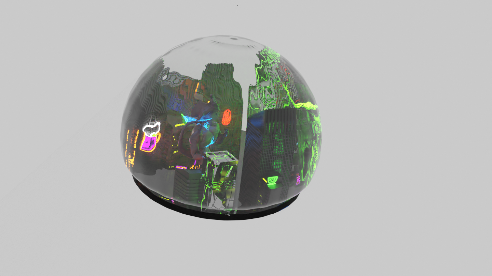
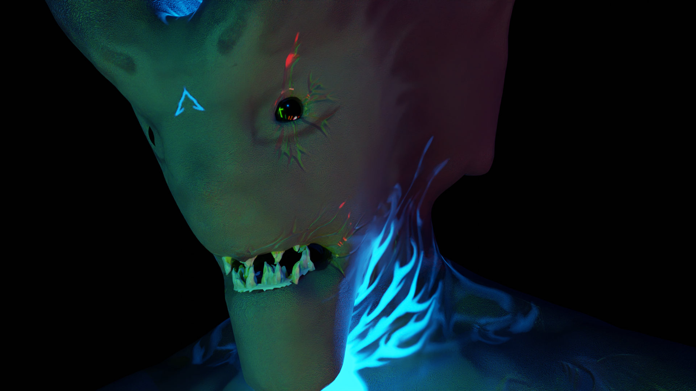

# Apex - My-first-blender-scene
So this is my first Blender scene I ever created. It was created within the scope of the HBK Saar course "Blender 2.9x Basics".
In this scene I challenged me to make my first steps in modeling, sculpting, shading, rigging and VFX.
To be honest, I am quite content with the result for the given timeframe, eventhough I would have liked to increase the realism further.

You can find my renders inside this repository as well as a rather loose documentation of the process.

For the blenderfile please feel free to use the following link to download it (It exceeds my git lfs data quoata): https://drive.google.com/file/d/14ozV_EPlD80UMoKlkE8QIR7D3-afoFfT/view?usp=sharing

## The final Render

## With some Fog

## From the Outside

## Profile of the Kaiju

